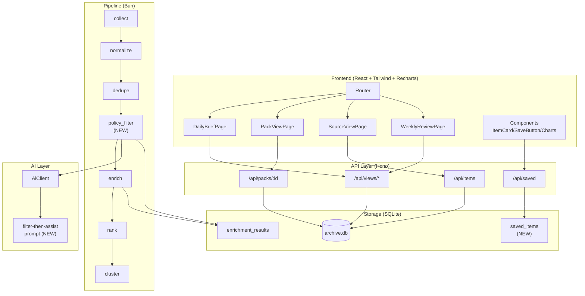
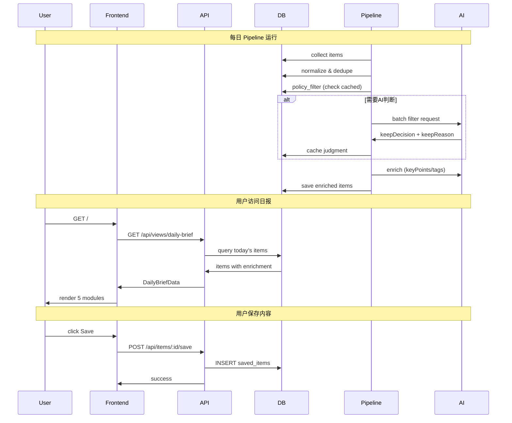

# Design: Editorial Redesign v1

## Overview

将信息聚合器升级为"编辑部式个人注意力管理系统"。核心变更：**Source Policy 层**（`assist_only`/`filter_then_assist`）、**AI 判断字段**（`keepDecision`/`keepReason`/`readerBenefit`）、**四视图前端系统**（日报首页/Pack 视图/来源视图/周报视图）、**Save For Later 功能**。

## Architecture



### Data Flow



## Data Model

### 新增类型定义

```typescript
// src/types/policy.ts (NEW)

/** 来源策略模式 */
export type PolicyMode = 'assist_only' | 'filter_then_assist';

/** Pack 级策略配置 */
export interface PackPolicy {
  mode: PolicyMode;
  /** 自定义过滤 prompt（可选） */
  filterPrompt?: string;
}

/** 来源级策略配置（可覆盖 Pack 级） */
export interface SourcePolicy extends PackPolicy {
  /** 继承自 Pack */
  inheritedFrom?: string;
}
```

```typescript
// src/types/ai-response.ts (扩展)

/** AI 判断结果 */
export interface FilterJudgment {
  /** 是否保留 */
  keepDecision: boolean;
  /** 判断理由（1-2 句话） */
  keepReason: string;
  /** 阅读价值（保留时） */
  readerBenefit?: string;
  /** 阅读建议（保留时，如"3分钟速读"） */
  readingHint?: string;
  /** 判断时间 */
  judgedAt: string;
}

/** AiEnrichmentResult 扩展 */
export interface AiEnrichmentResult {
  // 现有字段
  keyPoints?: string[];
  tags?: string[];
  summary?: string;
  score?: number;
  multiScore?: MultiDimensionalScore;

  // 新增字段
  filterJudgment?: FilterJudgment;
}
```

```typescript
// src/types/index.ts (扩展 SourcePack)

export interface SourcePack {
  id: string;
  name: string;
  description?: string;
  keywords?: string[];
  auth?: string;
  sources: InlineSource[];
  promptTemplate?: string;
  viewTemplate?: string;

  // 新增
  policy?: PackPolicy;
}

export interface InlineSource {
  type: SourceType;
  url: string;
  description?: string;
  enabled?: boolean;
  configJson?: string;

  // 新增
  policy?: SourcePolicy;
}
```

```typescript
// src/api/types.ts (扩展 ItemData)

export interface ItemData {
  // 现有字段...
  id: string;
  title: string;
  // ...

  // 新增
  policy: {
    mode: PolicyMode;
  };
  filterJudgment?: {
    keepDecision: boolean;
    keepReason: string;
    readerBenefit?: string;
    readingHint?: string;
  };
  saved?: {
    savedAt: string;
  };
}
```

### 数据库 Schema 变更

```sql
-- Migration 004: Editorial redesign

-- saved_items 表
CREATE TABLE IF NOT EXISTS saved_items (
  id TEXT PRIMARY KEY,
  item_id TEXT NOT NULL,
  pack_id TEXT,
  saved_at TEXT NOT NULL,
  FOREIGN KEY (item_id) REFERENCES raw_items(id) ON DELETE CASCADE
);
CREATE INDEX IF NOT EXISTS idx_saved_items_item ON saved_items(item_id);
CREATE INDEX IF NOT EXISTS idx_saved_items_saved_at ON saved_items(saved_at);

-- enrichment_results 表扩展（添加 filter_judgment）
ALTER TABLE enrichment_results ADD COLUMN filter_judgment_json TEXT;

-- sources 表扩展（添加 policy）
ALTER TABLE sources ADD COLUMN policy_json TEXT;

-- source_packs 表扩展（添加 policy）
ALTER TABLE source_packs ADD COLUMN policy_json TEXT;
```

### 迁移策略

1. 启动时自动执行 `004_editorial.sql`
2. 已有数据 `policy` 默认 `filter_then_assist`
3. 已有 enrichment 结果 `filterJudgment` 为 `null`（按需补算）

## Pipeline Design

### Policy Filter 阶段

位置：`dedupe` 之后、`enrich` 之前

```typescript
// src/pipeline/policy-filter.ts (NEW)

export interface PolicyFilterConfig {
  /** AI 客户端 */
  aiClient?: AiClient | null;
  /** 数据库（用于缓存） */
  db?: Database | null;
  /** 批量判断大小 */
  batchSize?: number;
  /** 并发数 */
  concurrency?: number;
}

export interface PolicyFilterResult<T extends RankedCandidate> {
  kept: T[];
  filtered: T[];
  stats: {
    total: number;
    kept: number;
    filtered: number;
    cached: number;
    aiJudged: number;
  };
}

/**
 * 策略过滤阶段
 * - assist_only: 全部保留
 * - filter_then_assist: AI 判断
 */
export async function policyFilterCandidates<T extends RankedCandidate>(
  candidates: T[],
  pack: SourcePack,
  sourcePolicyMap: Map<string, SourcePolicy>,
  config: PolicyFilterConfig = {},
): Promise<PolicyFilterResult<T>> {
  // 1. 按 source 分组
  // 2. assist_only 组直接保留
  // 3. filter_then_assist 组调用 AI 判断
  // 4. 合并结果
}
```

### AI 判断流程

```typescript
// src/ai/prompts-filter.ts (NEW)

export function buildFilterPrompt(
  items: Array<{ id: string; title: string; snippet?: string }>,
  packContext: { name: string; keywords?: string[] },
): string {
  return `你是内容策展人。根据 Pack 主题判断以下内容是否值得保留。

Pack: ${packContext.name}
关键词: ${packContext.keywords?.join(', ') || '无'}

待判断内容:
${items.map((item, i) => `[${i + 1}] ${item.title}\n${item.snippet || ''}`).join('\n\n')}

对每条内容返回：
{
  "judgments": [
    {
      "index": 1,
      "keep": true/false,
      "reason": "1-2句判断理由",
      "benefit": "阅读价值（保留时）",
      "hint": "阅读建议（保留时，如'3分钟速读'）"
    }
  ]
}`;
}
```

### 缓存策略

- **判断缓存**：存储到 `enrichment_results.filter_judgment_json`，无限期缓存
- **查询缓存**：先查 DB，命中则跳过 AI 调用
- **批量优化**：单次请求处理 10 个 item，< 5s 完成批量判断

## API Design

### GET /api/views/daily-brief

```typescript
// Request
GET /api/views/daily-brief?packIds=ai-daily,tech-news

// Response
interface DailyBriefResponse {
  success: boolean;
  data: {
    coverStory: ItemData | null;       // 1 条，最高分
    leadStories: ItemData[];           // 3 条，次高分
    topSignals: ItemData[];            // 5-10 条，keepReason 标签
    scanBrief: ItemData[];             // 标题列表
    savedForLater: ItemData[];         // 已保存内容
    meta: {
      generatedAt: string;
      totalItems: number;
      keptItems: number;
      retentionRate: number;
    };
  };
}
```

### GET /api/packs/:id (扩展)

```typescript
// Response 扩展
interface PackDetailResponse {
  success: boolean;
  data: {
    id: string;
    name: string;
    description: string | null;
    // 现有字段...

    // 新增
    policy: {
      mode: PolicyMode;
    };
    stats: {
      sourceCount: number;
      totalItems: number;
      retainedItems: number;
      retentionRate: number;          // 近 7 天
    };
    sourceComposition: Array<{
      type: string;
      count: number;
      percentage: number;
    }>;
    featuredItems: ItemData[];        // 3-5 条代表内容
    weeklyTrends: {
      tags: Array<{ tag: string; count: number }>;
      topics: string[];               // AI 生成
    };
  };
}
```

### GET /api/sources/:id (新增)

```typescript
interface SourceDetailResponse {
  success: boolean;
  data: {
    id: string;
    type: string;
    packId: string;
    description: string | null;
    url: string;

    policy: {
      mode: PolicyMode;
      inheritedFrom?: string;
    };

    stats: {
      retentionRate: number;          // 近 7 天
      totalItems: number;
      retainedItems: number;
    };

    filterReasons: Array<{
      reason: string;
      count: number;
      percentage: number;
    }>;

    recentItems: ItemData[];          // 最近 10 条
  };
}
```

### GET /api/views/weekly-review (新增)

```typescript
interface WeeklyReviewResponse {
  success: boolean;
  data: {
    overview: {
      totalItems: number;
      retainedItems: number;
      avgScore: number;
      dateRange: { start: string; end: string };
    };

    topics: Array<{
      title: string;                  // AI 生成
      items: ItemData[];              // 3-5 条代表内容
    }>;

    editorPicks: ItemData[];          // 用户保存的内容
  };
}
```

### POST /api/items/:id/save (新增)

```typescript
// Request
POST /api/items/:id/save
{ "packId": "ai-daily" }

// Response
{ "success": true, "data": { "savedAt": "2026-03-17T10:00:00Z" } }
```

### DELETE /api/items/:id/save (新增)

```typescript
// Response
{ "success": true }
```

### GET /api/saved (新增)

```typescript
interface SavedItemsResponse {
  success: boolean;
  data: {
    items: ItemData[];
    meta: { total: number };
  };
}
```

## Frontend Architecture

### 组件层次结构

```
frontend/src/
├── App.tsx                    # 路由配置
├── pages/
│   ├── DailyBriefPage.tsx     # 日报首页（5 模块）
│   ├── PackViewPage.tsx       # Pack 策展视图
│   ├── SourceViewPage.tsx     # 来源视图
│   └── WeeklyReviewPage.tsx   # 周报视图
├── components/
│   ├── layout/
│   │   ├── Layout.tsx
│   │   ├── Sidebar.tsx
│   │   └── Navbar.tsx         # 新增导航
│   ├── items/
│   │   ├── ItemCard.tsx       # 扩展：显示 keepReason
│   │   ├── ItemCardWithReason.tsx  # 新增
│   │   ├── CoverStoryCard.tsx      # 新增：大卡片
│   │   ├── LeadStoryCard.tsx       # 新增：中卡片
│   │   └── SignalCard.tsx          # 新增：紧凑卡片
│   ├── views/
│   │   ├── CoverStorySection.tsx
│   │   ├── LeadStoriesSection.tsx
│   │   ├── TopSignalsSection.tsx
│   │   ├── ScanBriefSection.tsx
│   │   └── SavedForLaterSection.tsx
│   ├── pack/
│   │   ├── PackStats.tsx           # 策略摘要
│   │   ├── SourceCompositionChart.tsx  # Recharts 饼图
│   │   └── WeeklyTrends.tsx        # 标签云
│   ├── save/
│   │   └── SaveButton.tsx          # 保存按钮
│   └── charts/
│       ├── RetentionChart.tsx      # 保留率图表
│       └── FilterReasonsChart.tsx  # 过滤理由分布
├── hooks/
│   ├── useApi.ts              # 扩展新端点
│   ├── useDailyBrief.ts       # 新增
│   ├── usePackDetail.ts       # 新增
│   ├── useSourceDetail.ts     # 新增
│   ├── useWeeklyReview.ts     # 新增
│   └── useSavedItems.ts       # 新增
└── types/
    └── api.ts                 # 扩展类型
```

### 路由配置

```typescript
// frontend/src/App.tsx
import { BrowserRouter, Routes, Route, Navigate } from 'react-router-dom';

function App() {
  return (
    <BrowserRouter>
      <Layout>
        <Routes>
          <Route path="/" element={<DailyBriefPage />} />
          <Route path="/pack/:id" element={<PackViewPage />} />
          <Route path="/source/:id" element={<SourceViewPage />} />
          <Route path="/weekly" element={<WeeklyReviewPage />} />
          <Route path="/items" element={<ItemsPage />} />  {/* 传统列表页 */}
          <Route path="*" element={<Navigate to="/" />} />
        </Routes>
      </Layout>
    </BrowserRouter>
  );
}
```

### 状态管理

- **URL State**: packIds, sourceIds, window（通过 URL 参数）
- **Local State**: 页面加载状态、保存状态
- **Server State**: React Query 或 useApi hooks（当前模式）

### Recharts 集成

```typescript
// frontend/src/components/charts/SourceCompositionChart.tsx
import { PieChart, Pie, Cell, Tooltip, Legend } from 'recharts';

interface Props {
  data: Array<{ type: string; count: number; percentage: number }>;
}

export function SourceCompositionChart({ data }: Props) {
  const COLORS = ['#0088FE', '#00C49F', '#FFBB28', '#FF8042'];

  return (
    <PieChart width={300} height={200}>
      <Pie
        data={data}
        dataKey="count"
        nameKey="type"
        cx="50%"
        cy="50%"
        outerRadius={80}
        label={({ type, percentage }) => `${type} ${percentage}%`}
      >
        {data.map((_, index) => (
          <Cell key={index} fill={COLORS[index % COLORS.length]} />
        ))}
      </Pie>
      <Tooltip />
    </PieChart>
  );
}
```

## File Structure

| File | Action | Purpose |
|------|--------|---------|
| `src/types/policy.ts` | Create | PolicyMode, PackPolicy, SourcePolicy 类型 |
| `src/types/index.ts` | Modify | SourcePack/InlineSource 添加 policy 字段 |
| `src/types/ai-response.ts` | Modify | 添加 FilterJudgment 类型 |
| `src/pipeline/policy-filter.ts` | Create | 策略过滤阶段 |
| `src/ai/prompts-filter.ts` | Create | filter-then-assist prompt |
| `src/ai/client.ts` | Modify | 添加 batchFilter 方法 |
| `src/db/migrations/004_editorial.sql` | Create | saved_items 表 + 字段扩展 |
| `src/db/queries/saved-items.ts` | Create | 保存/查询 saved items |
| `src/db/queries/sources.ts` | Modify | 添加 policy 查询 |
| `src/config/load-pack.ts` | Modify | 解析 policy 字段 |
| `src/api/types.ts` | Modify | ItemData 添加 policy/filterJudgment/saved |
| `src/api/routes/views.ts` | Create | /api/views/* 端点 |
| `src/api/routes/items.ts` | Modify | 添加 save/unsave 端点 |
| `src/api/routes/packs.ts` | Modify | 扩展详情返回 |
| `src/api/routes/sources.ts` | Create | /api/sources/:id 端点 |
| `src/api/server.ts` | Modify | 注册新路由 |
| `src/views/registry.ts` | Modify | 添加 weekly-review 视图 |
| `src/views/weekly-review.ts` | Create | 周报视图构建 |
| `frontend/src/App.tsx` | Modify | 添加路由配置 |
| `frontend/src/pages/DailyBriefPage.tsx` | Create | 日报首页 |
| `frontend/src/pages/PackViewPage.tsx` | Create | Pack 视图 |
| `frontend/src/pages/SourceViewPage.tsx` | Create | 来源视图 |
| `frontend/src/pages/WeeklyReviewPage.tsx` | Create | 周报视图 |
| `frontend/src/components/items/*.tsx` | Create | 新卡片组件 |
| `frontend/src/components/views/*.tsx` | Create | 视图模块组件 |
| `frontend/src/components/save/SaveButton.tsx` | Create | 保存按钮 |
| `frontend/src/components/charts/*.tsx` | Create | Recharts 图表 |
| `frontend/src/hooks/*.ts` | Create | 新 API hooks |
| `frontend/src/types/api.ts` | Modify | 扩展 API 类型 |
| `frontend/package.json` | Modify | 添加 recharts, react-router-dom |

## Technical Decisions

| Decision | Options | Choice | Rationale |
|----------|---------|--------|-----------|
| **过滤内容存储** | A) 不存储 B) 持久化 DB | B | 支持来源视图的过滤统计 |
| **AI 判断缓存** | A) TTL 缓存 B) 无限期 | B | 同一内容不重复判断，节省 API 成本 |
| **主题聚合算法** | A) Tags 聚类 B) AI 生成 | B | 更准确，符合用户决策 |
| **图表库** | A) Chart.js B) D3 C) Recharts | C | 轻量、React 原生、Tree-shakable |
| **前端路由** | A) 现有状态 B) react-router | B | 支持多视图 URL 导航 |
| **Save For Later** | A) localStorage B) 后端 DB | B | 跨设备同步、持久化 |
| **Pipeline 位置** | A) CLI only B) API 集成 | A | 保持确定性，API 仅读取 |
| **默认策略** | A) assist_only B) filter_then_assist | B | 新来源默认启用 AI 过滤 |

## Edge Cases

- **空内容**：日报首页无内容时显示友好提示
- **AI 判断失败**：fallback 到 `assist_only`，保留所有内容
- **Save 冲突**：重复保存返回已存在状态，幂等处理
- **跨 Pack 来源**：来源 ID 格式 `{packId}::{sourceUrl}`，确保唯一
- **周报无数据**：显示"本周暂无数据"提示

## Error Handling

| Scenario | Strategy | User Impact |
|----------|----------|-------------|
| AI 判断超时 | 降级为 assist_only，记录 warn | 内容保留但无过滤 |
| 数据库写入失败 | 返回 500，重试 | 操作失败，刷新重试 |
| Pack 配置解析失败 | 使用默认 policy | 配置被忽略 |
| 前端路由错误 | 重定向到日报首页 | 404 → 首页 |

## Test Strategy

### Unit Tests

- `src/pipeline/policy-filter.test.ts`: 策略过滤逻辑
- `src/ai/prompts-filter.test.ts`: Prompt 构建
- `src/db/queries/saved-items.test.ts`: CRUD 操作
- `src/config/load-pack.test.ts`: Policy 解析

### Integration Tests

- API 端点响应格式
- Pipeline 端到端流程
- 保存/取消保存流程

### E2E Tests

- 日报首页 5 模块渲染
- Save 按钮交互
- 路由导航

## Performance Considerations

- **日报首页**：< 500ms，预计算 + 缓存
- **AI 判断**：批量处理 10 items < 5s
- **前端包大小**：Recharts tree-shaking，< 200KB gzip
- **数据库索引**：saved_items.item_id, filter_judgment_json 查询优化

## Security Considerations

- 无用户认证（单用户场景）
- Pack YAML 来源可信（本地配置）
- API 无敏感数据暴露

## Unresolved Questions

- 无

## Implementation Steps

### Phase 1: Policy Layer + Daily Brief + Pack View

1. 创建 `src/types/policy.ts`，定义 PolicyMode 类型
2. 扩展 `SourcePack`/`InlineSource`，添加 policy 字段
3. 修改 `src/config/load-pack.ts`，解析 policy
4. 创建 `src/db/migrations/004_editorial.sql`
5. 创建 `src/pipeline/policy-filter.ts`，实现策略过滤
6. 创建 `src/ai/prompts-filter.ts`，filter-then-assist prompt
7. 扩展 `AiClient`，添加 batchFilter 方法
8. 创建 `src/api/routes/views.ts`，daily-brief 端点
9. 扩展 `src/api/routes/packs.ts`，添加统计和代表内容
10. 创建 `src/db/queries/saved-items.ts`
11. 扩展 items route，添加 save/unsave 端点
12. 前端：安装 recharts, react-router-dom
13. 创建 `DailyBriefPage.tsx`，5 模块布局
14. 创建 `PackViewPage.tsx`，策展视图
15. 创建 `SaveButton.tsx`，保存交互
16. 更新 `App.tsx`，路由配置

### Phase 2: Source View + Weekly Review

1. 创建 `src/api/routes/sources.ts`，来源详情端点
2. 创建 `src/views/weekly-review.ts`，周报视图构建
3. 扩展 views route，添加 weekly-review 端点
4. 创建 `SourceViewPage.tsx`，来源视图
5. 创建 `WeeklyReviewPage.tsx`，周报视图
6. 创建 Recharts 图表组件
7. 添加前端测试
